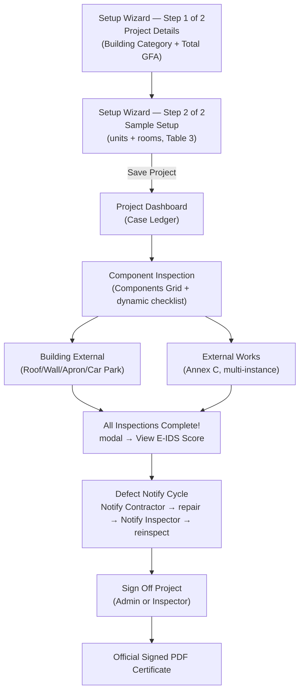
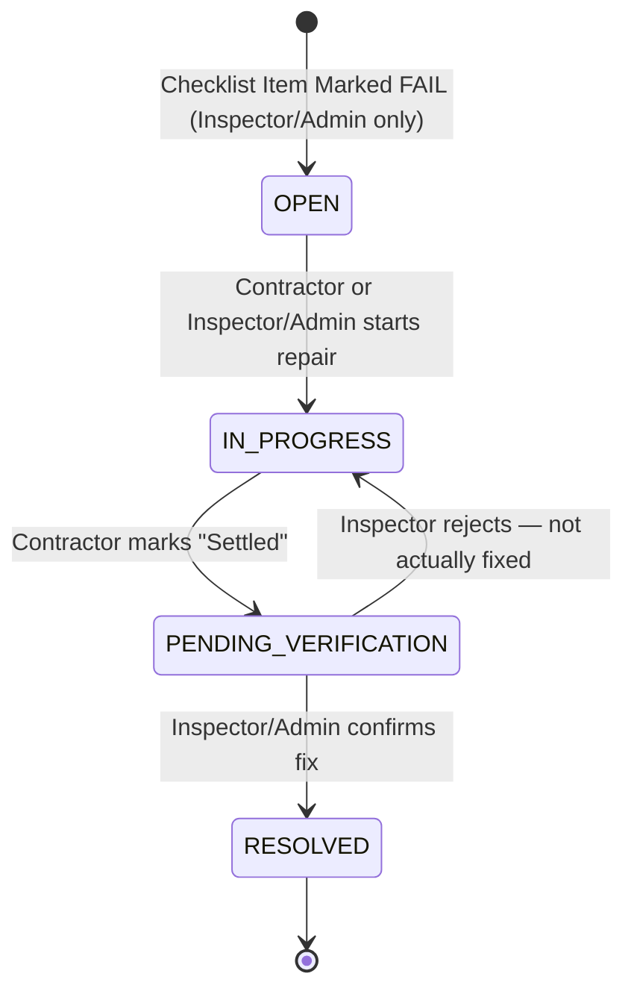
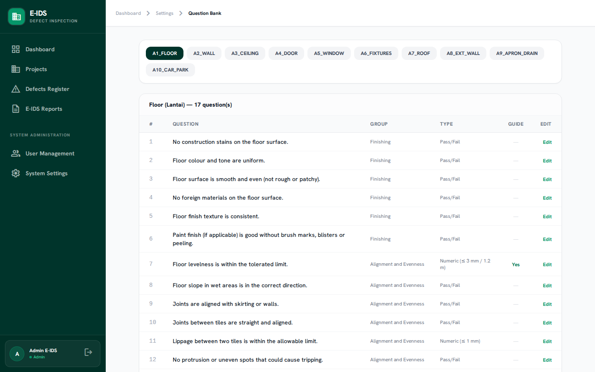
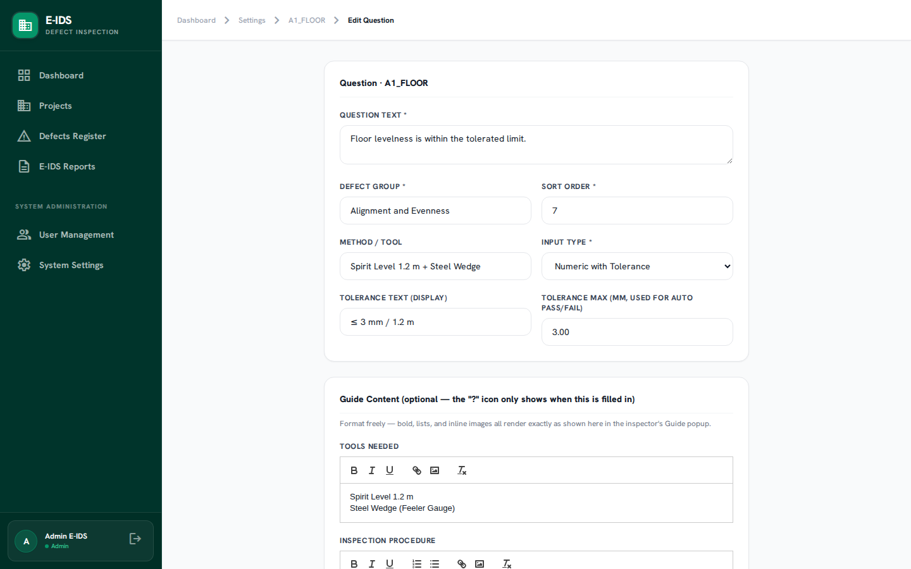
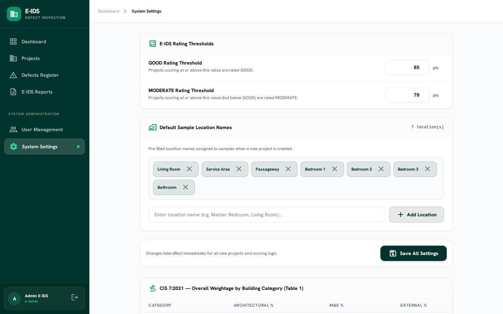

# E-IDS v2 — Admin Manual
**Electronic Inspection Defect System (E-IDS v2)**
*Operational Manual for System Admins*

> Updated 2026-08-06. This is the Admin-focused edition of the full E-IDS v2 User Manual — it covers everything an Admin needs: project setup, oversight of Inspector and Contractor work, sign-off, and system configuration. A few screenshots below predate the latest UI refresh (button labels changed) — the described behavior is current.

*The sign-in screen every role shares — the same login form routes Admin, Inspector, and Contractor to their own scoped view of the system.*

---

## 1. System Overview

E-IDS v2 is a specialized web-based building defect inspection and scoring platform for the Malaysian construction sector, implementing **CIS 7:2021** (CIDB's Construction Industry Standard) natively rather than approximating it. As Admin, you sit at the top of every project: you register it, assign who works it, and hold the exclusive keys to system-wide configuration.

You perform the first stage yourself (project registration), hand off the middle stage to your Inspector and Contractor, and hold final authority over system configuration throughout — though sign-off itself can now be done by either you or the Inspector once every defect is closed.

*Your landing page — project totals, the average score across every project in the system, and an Action Required list.*

---

## 2. Your Role, and Everyone Else's

**👑 You (Admin).** The office-side owner of the whole portfolio. You register projects, decide who inspects them and which contractor is on the hook for repairs, and hold the exclusive keys to system-wide configuration — user accounts, the CIS 7:2021 weightage/sampling tables, and the question bank's content and Guide material. You can see and open every project in the system, and can step into any Inspector-facing screen (Sample Setup, Notify Contractor, Sign Off) if needed — but day-to-day inspection work is normally your Inspector's job.

**🔍 Inspector.** The field role. Sees only the projects they're assigned to, and owns everything that happens on site: naming sample locations, running the Components Grid checklist, completing Building External and External Works, and reinspecting a Contractor's repair before confirming it resolved. An Inspector can also **Sign Off** a project themselves once every defect is closed — they don't have to hand that final step back to you.

**🔧 Contractor.** The narrowest role. Logs in directly to **My Defects** — no Dashboard, Projects list, or Reports access, because there's nothing for them to do there. Their whole job: get notified about a defect, mark it in progress, mark it settled once fixed, and repeat. They can never mark their own work fully `RESOLVED`.

### Permission Matrix

| Action / Capability | Admin | Inspector | Contractor |
| :--- | :---: | :---: | :---: |
| View Dashboard, Projects & Reports | ✅ all | ✅ assigned | ❌ |
| Download Official PDF Report | ✅ all | ❌ (view score only) | ❌ |
| Register & Edit Projects | ✅ | ✅ | ❌ |
| Assign the Inspector (`assigned_to`) | ✅ | ❌ (locked to self) | ❌ |
| Assign the Contractor (`assigned_contractor_id`) | ✅ | ✅ | ❌ |
| Configure Sample Locations & Optional Elements | ✅ | ✅ | ❌ |
| Perform Component Inspection Checklists | ❌ (handed off to Inspector) | ✅ | ❌ |
| Add/Remove External Works Instances | ✅ | ✅ | ❌ |
| Declare QP Certifications | ✅ | ✅ | ❌ |
| View Defects Register / My Defects | ✅ all | ✅ assigned projects | ✅ own-assigned project only |
| Create / Manually Log a Defect | ✅ | ✅ | ❌ |
| Notify Contractor about Open Defects | ✅ | ✅ | n/a |
| Mark Defect `IN_PROGRESS` ("Start Repair") | ✅ | ✅ | ✅ |
| Mark `IN_PROGRESS → PENDING_VERIFICATION` ("Mark Settled") | ✅ | ✅ | ✅ |
| Confirm `RESOLVED` or Reject back to `IN_PROGRESS` | ✅ | ✅ | ❌ |
| Sign Off Project | ✅ | ✅ | ❌ |
| Manage Users & Role Access | ✅ | ❌ | ❌ |
| Edit Weightage/Sampling Tables & Question Bank | ✅ | ❌ | ❌ |
| Delete Project | ✅ | ❌ | ❌ |

> [!IMPORTANT]
> Opening a project or defect you don't have visibility into — from a list or by typing the URL directly — returns "Forbidden" for every role except Admin. You are the only role with no scoping restriction.

---

## 3. Defect Lifecycle & Status Workflow

> [!IMPORTANT]
> **Who updates defect status?** The Contractor updates the repair steps themselves (`IN_PROGRESS`, `PENDING_VERIFICATION`). The final `RESOLVED` confirmation — and the ability to reject a repair back to `IN_PROGRESS` — is reserved for the **Inspector or Admin**. A Contractor can never self-certify their own work as fully resolved.

1. **🔴 OPEN** — auto-created when any checklist question is marked `FAIL`, or manually logged. Visible to the assigned Contractor's My Defects and the office's Defects Register.
2. **🟡 IN_PROGRESS** — the Contractor clicks **Start Repair**. You or the Inspector can also set this manually.
3. **🔵 PENDING_VERIFICATION** — the Contractor clicks **Mark Settled**, which notifies the Inspector to reinspect. The Contractor can't advance it further themselves from here.
4. **🟢 RESOLVED** — the Inspector or you confirm the fix on-site with **Confirm Resolved**, or send it back with **Reject – Not Fixed**.

---

## 4. Component Inspection, M&E, and External Works — What Your Inspector Is Doing

Each of the 8 architectural components (Floor, Internal Wall, Ceiling, Door, Window, Internal Fixtures, Roof, External Wall) has its own question bank straight out of CIS 7:2021's Annex A — Floor alone has 17 questions. You manage this content (§6); your Inspector answers it project by project.

- **Room-scoped** components (Floor, Internal Wall, Ceiling, Door, Window, Internal Fixtures) — inspected at each sample room, in the **Components Grid**.
- **Building-scoped** components (Roof, External Wall, Apron & Perimeter Drain, Car Park) — sampled as building-level sections on their own page, sample count scaling with unit count.
- **M&E Fittings (Annex B)** — a 6-question checklist assessed at the same room samples.
- **External Works (Annex C)** — Link-way/Shelter, External Drain, Roadwork, Footpath & Turfing, Fence & Gate, Playground, Court, Swimming Pool, each supporting multiple instances of the same element.
- **QP Declarations** — Skim Coat/Prepacked Plaster and Wet-area Water-tightness aren't inspected on-site; they're Qualified Person certifications attached as evidence on the project page.

---

## 5. E-IDS Scoring Framework (CIS 7:2021)

$$S_{\text{total}} = S_{\text{arch}} + S_{\text{ME}} + S_{\text{external}}$$

| Category | Architectural | M&E | External |
| :--- | :---: | :---: | :---: |
| A — Landed Housing | 85% | 2% | 13% |
| B — Stratified Housing | 83% | 3% | 14% |
| C — Commercial/Industrial (no CCS) | 82% | 4% | 14% |
| D — Commercial/Industrial (with CCS) | 80% | 5% | 15% |

> [!NOTE]
> - 🟢 **GOOD**: Total score $\ge 85.00$ pts · 🟡 **MODERATE**: $\ge 70.00$ and $< 85.00$ · 🔴 **WEAK**: $< 70.00$ (thresholds are admin-configurable in §7 below)

---

## 6. Step-by-Step: Your Workflow as Admin

**A. Register a new project**
1. Navigate to **Projects** → click **+ New Project**.
2. Enter Project Ref No., Project Name, Developer, Contractor, Building Type, and **CIS 7:2021 Building Category** (Step 1 of 2 in the setup wizard).
3. Enter **Total Project GFA (m²)** — the whole project's combined floor area, not a single unit's. Sample units auto-calculate via Table 3's clamped formula.
4. Select the **Assigned Inspector** and **Assigned Contractor**.
5. Click **Create Project & Initialize Samples**.

**B. Finish sample setup and hand off**
1. On **Sample Setup** (Step 2 of 2), samples are pre-distributed across units and pre-named per CIS 7:2021 §1.7.
2. Adjust room names, location type, and mark whether Car Park / Apron & Perimeter Drain exist.
3. Click **Save Project**, confirm the modal, and you land on the **Project Dashboard**. Your Inspector can now begin.

**C. Monitor and intervene**
1. Open the project anytime to see the **Case Ledger** — Setup & Assignment, Field Inspection, Defect Rectification, Final Certificate — each row shows whose turn it is.
2. If inspection is done but defects remain open, click **Notify Contractor** on the Defect Rectification row, confirm the modal, and the Contractor sees them flagged.
3. You can perform any Inspector-facing action yourself if needed.

**D. Sign off and export the certificate**
1. Once every defect is `RESOLVED`, click **Sign Off Project** (you or your Inspector can do this).
2. Confirm the modal — the project status becomes **Completed**.
3. Click **Generate Official PDF Report** (a small print-style link) for the signed certificate, including QP Declaration status and Detailed Findings.

---

## 7. Managing the Question Bank & Guide Content

**Settings → Question Bank** lists every architectural component's checklist. Click a component tab, then **Edit** on any question to change its text, defect group, method/tool, tolerance, or input type.

Each question also has an optional **Guide** section — a rich-text editor (bold, lists, links, inline images) for Tools Needed, Inspection Procedure, and Result Thresholds. Leave it blank to keep the "?" icon hidden.

---

## 8. Weightage & Sampling Settings

**Settings** exposes CIS 7:2021's reference tables directly, editable per Building Category:

- **Table 1** — overall Architectural/M&E/External % split by Building Category.
- **Table 4** — Principal/Service/Circulation location weighting by Building Category.
- **Table 3** — sample count formula (GFA divisor, min/max samples) by Building Category.
- **Table 2** — architectural component weightage, including the two QP declaration rows.

Changes apply immediately to scoring on every project — there's no need to re-create existing projects.

---

## 9. Demo / Testing Accounts

Running `docker exec -w /var/www eidsv2 php artisan migrate:fresh --seed` loads a ready-to-test dataset.

| Role | Account | Password | Scope |
| :--- | :--- | :--- | :--- |
| Admin | `admin@eids.gov.my` | `password` | Sees everything; created all three projects |
| Inspector | `inspector.a@eids.gov.my` | `password` | Assigned to Project 1 and Project 3 |
| Inspector | `inspector.b@eids.gov.my` | `password` | Assigned to Project 2 only |
| Contractor | `contractor.a@eids.gov.my` | `password` | Assigned to Project 1 only |
| Contractor | `contractor.b@eids.gov.my` | `password` | Assigned to Project 2 and Project 3 |

**Project 1 — "Taman Merlimau Perdana" (PRJ-2026-001):** Category A, 50 units, 150 samples, score **95.68 — GOOD**. Carries a hand-built defect narrative — one defect in each of the four lifecycle states.

**Project 2 — "Desa Aman Villa" (PRJ-2026-002):** Category A, 20 units, 38 samples, score **87.74 — GOOD**. No Car Park — demonstrates Table 2 weightage redistribution.

**Project 3 — "Kota Laksamana Heights" (PRJ-2026-003):** Category A, 12 units, 31 samples, score **99.53 — GOOD**. Fully signed off — use this one to see the unlocked certification seal, the fully-stamped Case Ledger, and the Official PDF Certificate.
