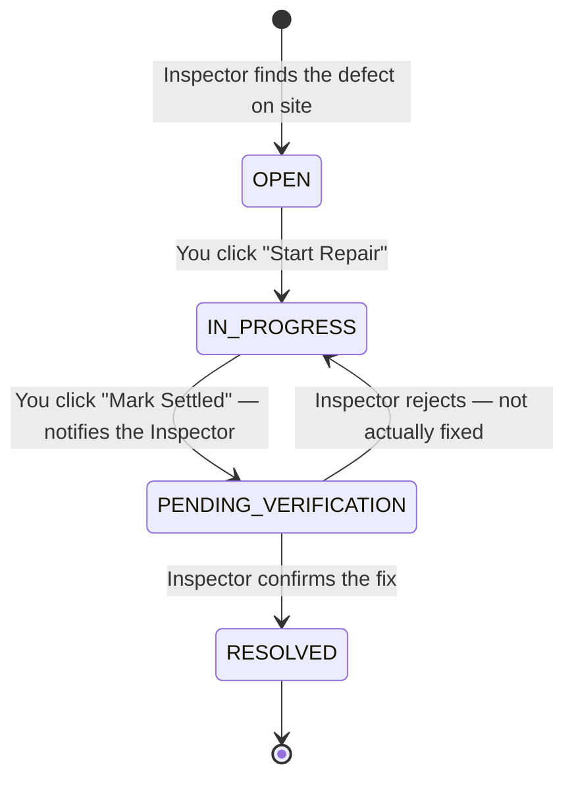

# E-IDS v2 — Contractor Manual
**Electronic Inspection Defect System (E-IDS v2)**
*Operational Manual for Contractors*

> Updated 2026-08-06. This is the short, Contractor-focused edition of the E-IDS v2 User Manual. Your role is deliberately narrow — this covers everything you'll actually see and do.

*The sign-in screen every role shares — your login routes you straight to your own defect list.*

---

## 1. What Is E-IDS?

E-IDS v2 is the digital system a project's Inspector uses to run a building defect inspection under **CIS 7:2021**. When the Inspector finds a defect, it's logged in the system and — once flagged to you — appears in your account for repair. You don't register projects, run inspections, or see scores; your whole job is closing out defects on the project(s) you're assigned to.

## 2. Your Role

**🔧 You (Contractor).** Your login opens directly to **My Defects** — there's no Dashboard, Projects list, or Reports link, because there's nothing for you to do there. Your job is: get notified about a defect, mark it in progress, mark it settled once fixed (which notifies the Inspector to come check), and repeat.

**🔍 Inspector.** Finds the defect on site, explicitly notifies you about it, and — after you mark it settled — reinspects and either confirms it resolved or sends it back to you if the fix doesn't hold up.

**👑 Admin.** Assigned you to the project in the first place and can also notify you about defects if the Inspector doesn't.

> [!IMPORTANT]
> You can never mark your own repair as fully `RESOLVED`. That confirmation always comes from the Inspector or Admin — it's not a restriction on trust, it's what makes the final sign-off meaningful for everyone who relies on this record.

### What You Can and Can't Do

| Action / Capability | You (Contractor) |
| :--- | :---: |
| View Dashboard, Projects & Reports | ❌ |
| View My Defects (your assigned project's defects) | ✅ |
| Create / Manually Log a Defect | ❌ |
| Mark Defect `IN_PROGRESS` ("Start Repair") | ✅ |
| Mark `IN_PROGRESS → PENDING_VERIFICATION` ("Mark Settled") | ✅ |
| Confirm `RESOLVED` or reject a repair | ❌ (Inspector/Admin only) |
| Everything else (projects, scoring, settings) | ❌ |

---

## 3. Defect Lifecycle & Status Workflow

1. **🔴 OPEN** — a defect has been logged and, once the Inspector or Admin clicks **Notify Contractor**, it's flagged in your list with severity, location, component, and any photo evidence.
2. **🟡 IN_PROGRESS** — you click **Start Repair** once work begins on site.
3. **🔵 PENDING_VERIFICATION** — you click **Mark Settled** once the repair is complete. A confirmation modal tells you this will notify the Inspector to reinspect — confirm it. From here you'll see a read-only "Awaiting Verification" badge; there's nothing more to do until the Inspector checks it.
4. **🟢 RESOLVED** — the Inspector confirms the fix on site. If they instead click **Reject – Not Fixed**, the defect comes back to you as `IN_PROGRESS` — repair it properly and mark it settled again.

*You see this same lifecycle from your scoped "My Defects" view — the action button always matches whoever's turn it is.*

---

## 4. Step-by-Step: Your Workflow

**A. Log in and find your defects**
1. Log in — you land directly on **My Defects**, scoped to the project(s) you're assigned to.
2. Defects the Inspector or Admin has explicitly flagged via **Notify Contractor** show up in a banner at the top ("N defect(s) flagged for your action") — start there. The full list below also shows everything on your projects regardless of notification state.

**B. Work each defect through to settlement**
1. Click **Start Repair** on an `OPEN` defect once work begins on site — it moves to `IN_PROGRESS`.
2. Once the repair is physically done, click **Mark Settled**. Confirm the modal — this notifies the Inspector that the defect is ready for reinspection — and it moves to `PENDING_VERIFICATION`.
3. You'll see a read-only "Awaiting Verification" badge — wait for the Inspector to check it.
4. If rejected, it returns to you as `IN_PROGRESS` — fix it properly and repeat from step 2. You'll never be asked (or able) to mark it `RESOLVED` yourself.

---

## 5. Demo / Testing Accounts

| Role | Account | Password | Scope |
| :--- | :--- | :--- | :--- |
| Contractor | `contractor.a@eids.gov.my` | `password` | Assigned to Project 1 only |
| Contractor | `contractor.b@eids.gov.my` | `password` | Assigned to Project 2 and Project 3 |

Log in as `contractor.a@eids.gov.my` and you'll see defects across all four lifecycle states on Project 1 — a good way to try **Start Repair** and **Mark Settled** yourself before going live.
