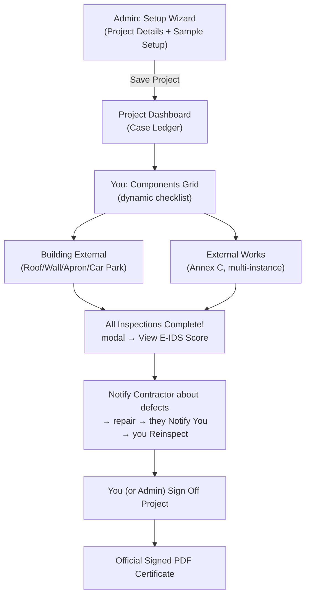
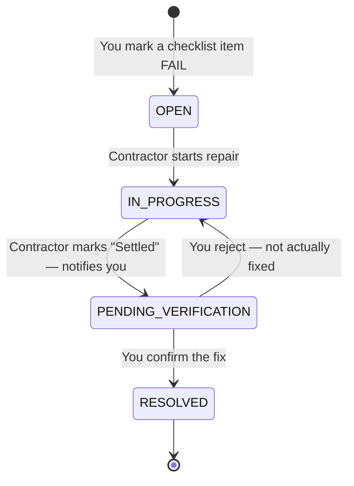
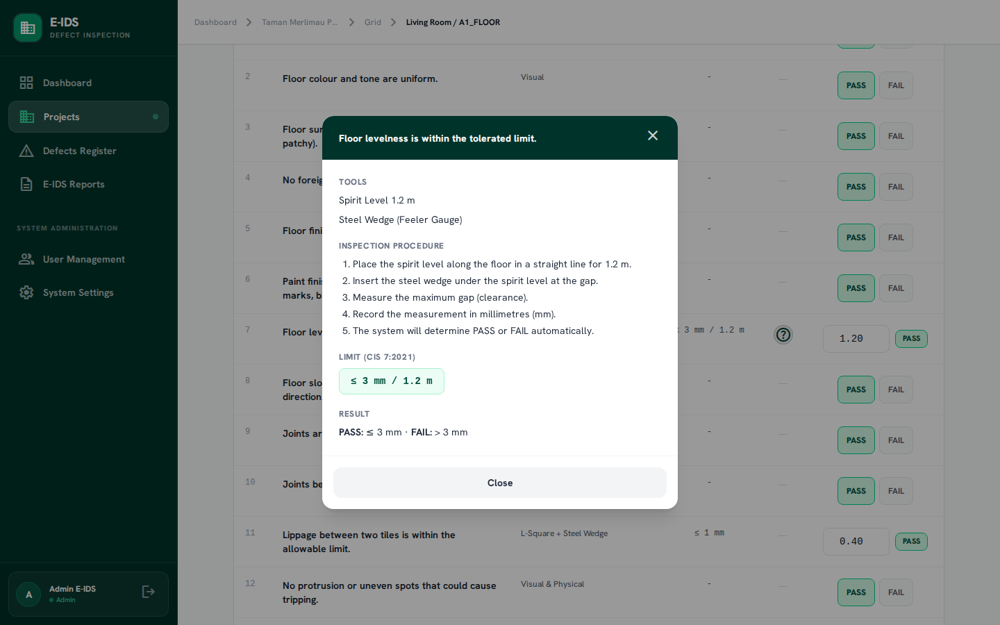
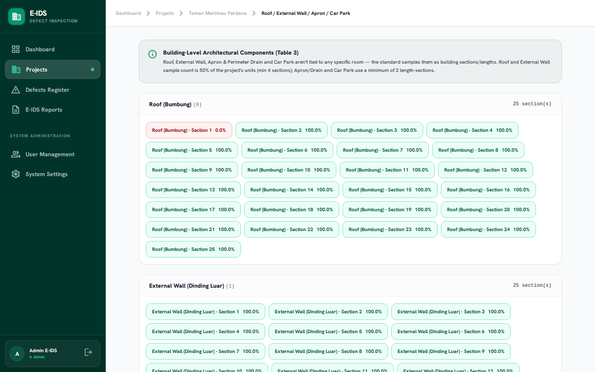
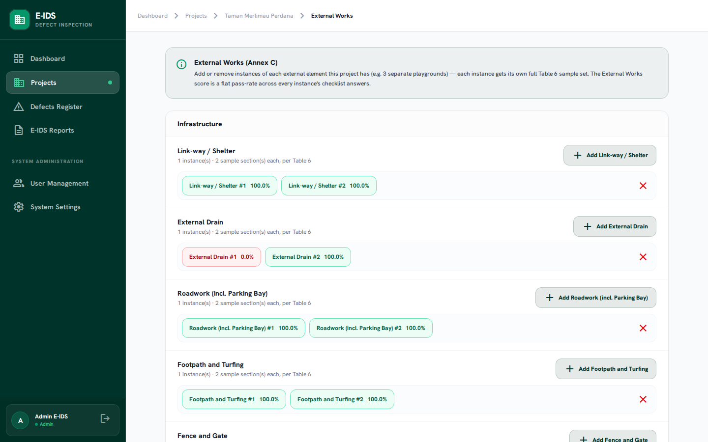

# E-IDS v2 — Inspector Manual
**Electronic Inspection Defect System (E-IDS v2)**
*Operational Manual for Field Inspectors*

> Updated 2026-08-06. This is the Inspector-focused edition of the full E-IDS v2 User Manual — everything you need for site inspection, the defect cycle, and sign-off. System configuration (question bank, weightage tables, user accounts) is managed by your Admin and isn't covered here. A few screenshots below predate the latest UI refresh (button labels changed) — the described behavior is current.

*The sign-in screen every role shares — the same login form routes you to your own scoped view of the system.*

---

## 1. System Overview

E-IDS v2 digitises building defect inspection for the Malaysian construction sector under **CIS 7:2021**. As Inspector, you're the field role: once an Admin registers a project and assigns it to you, everything from sample setup through the actual site checklist is your job.

*Your landing page after login — an Action Required list of everything across your assigned projects that needs attention right now.*

---

## 2. Your Role, and Everyone Else's

**🔍 You (Inspector).** The field role. You see only the projects you're assigned to (or unassigned ones open to any inspector), and own everything that happens on site: naming sample locations, running the Components Grid checklist room by room, completing Building External and External Works, uploading photo evidence, and reinspecting a Contractor's repair before confirming it resolved. You can also **Sign Off** a project yourself once every defect is closed — you don't have to hand that final step to an Admin.

**👑 Admin.** Registers the project, assigns you and the Contractor, and holds system configuration (question bank content, weightage tables, user accounts). Can step into any of your screens if needed, but day-to-day inspection is your job.

**🔧 Contractor.** Logs in directly to their scoped **My Defects** list — no Dashboard or Projects access. Their job: get notified about a defect you flagged, repair it, mark it settled (which notifies you to reinspect), and repeat. They can never mark their own work fully `RESOLVED` — that confirmation is always yours.

### What You Can and Can't Do

| Action / Capability | You (Inspector) |
| :--- | :---: |
| View Dashboard, Projects & Reports | ✅ assigned projects only |
| Download Official PDF Report | ❌ (view the score, PDF export is Admin's) |
| Register & Edit Projects | ✅ |
| Assign the Inspector | ❌ (locked to yourself) |
| Assign the Contractor | ✅ |
| Configure Sample Locations & Optional Elements | ✅ |
| Perform Component Inspection Checklists | ✅ |
| Add/Remove External Works Instances | ✅ |
| Declare QP Certifications | ✅ |
| Upload Photo Evidence | ✅ |
| View Defects Register | ✅ assigned projects |
| Create / Manually Log a Defect | ✅ |
| Notify Contractor about Open Defects | ✅ |
| Confirm `RESOLVED` or Reject a repair | ✅ |
| Sign Off Project | ✅ |
| Manage Users, Weightage Tables, Question Bank | ❌ (Admin only) |
| Delete Project | ❌ (Admin only) |

> [!IMPORTANT]
> Opening a project or defect you're not assigned to — from a list or by typing the URL directly — returns "Forbidden." This is enforced the same way across every screen.

---

## 3. Defect Lifecycle & Status Workflow

> [!IMPORTANT]
> The final `RESOLVED` confirmation — and the ability to reject a repair back to `IN_PROGRESS` — is yours (or Admin's) alone. A Contractor can never self-certify their own work as fully resolved, so this step never gets skipped.

1. **🔴 OPEN** — auto-created the moment you mark a checklist question `FAIL`. Immediately visible to the assigned Contractor.
2. **🟡 IN_PROGRESS** — the Contractor clicks **Start Repair** on site.
3. **🔵 PENDING_VERIFICATION** — the Contractor clicks **Mark Settled**, which notifies you the repair is ready to check. They can't advance it further from here.
4. **🟢 RESOLVED** — you re-inspect on site and click **Confirm Resolved**, or **Reject – Not Fixed** to send it back for another attempt.

---

## 4. Component Inspection — The Dynamic Checklist

There is no fixed 5-point checklist applied uniformly to every component. Each of the 8 architectural components (Floor, Internal Wall, Ceiling, Door, Window, Internal Fixtures, Roof, External Wall) has its **own** question bank straight out of CIS 7:2021's Annex A — Floor alone has 17 questions.

*Which physical unit, which room, and a full checklist table — Question / Method-Tool / Limit / Guide / Result. Numeric questions take a measurement and auto-derive PASS/FAIL against the tolerance; everything else is a PASS/FAIL toggle.*

### The Guide "?" Icon

Any question can have optional Guide content — tools needed, numbered inspection steps, the CIS 7:2021 limit, result thresholds, and inline reference photos. It only appears when your Admin has filled it in for that question.

### Two Kinds of Architectural Components

- **Room-scoped** (Floor, Internal Wall, Ceiling, Door, Window, Internal Fixtures) — inspected at each sample room, in the main **Components Grid**.
- **Building-scoped** (Roof, External Wall, Apron & Perimeter Drain, Car Park) — sampled as building-level sections, on their own **"Roof / Wall / Apron / Car Park"** page. Sample count scales with the project's unit count.

---

## 5. M&E Fittings & External Works (Annex B & C)

**M&E Fittings (Annex B)** get their own 6-question checklist, assessed at the same room samples as the architectural components — you'll see an "M&E Fittings" tile alongside Floor/Wall/etc. in the Components Grid.

**External Works (Annex C)** — Link-way/Shelter, External Drain, Roadwork, Footpath & Turfing, Fence & Gate, Playground, Court, Swimming Pool — live on their own page and support **multiple instances** of the same element.

*Click "Add [Element]" to generate another full instance; click the red "×" to remove one — this permanently deletes that instance's data.*

**QP Declarations** — Skim Coat/Prepacked Plaster and Wet-area Water-tightness aren't inspected on-site; attach the evidence document on the project page's QP Declarations card to earn their weightage.

---

## 6. E-IDS Scoring Framework (CIS 7:2021)

$$S_{\text{total}} = S_{\text{arch}} + S_{\text{ME}} + S_{\text{external}}$$

- **Architectural Subtotal**: each component's pass rate × its Table 2 weightage, further weighted across sample locations by Table 4 (Principal/Service/Circulation). If an optional element (Car Park, Apron/Drain) doesn't exist, its weightage redistributes automatically — the project isn't penalized for lacking it.
- **M&E Subtotal**: flat pass rate across every M&E answer, × the category's M&E %.
- **External Subtotal**: flat pass rate pooled across every present External Works instance, × the category's External %.

> [!NOTE]
> 🟢 **GOOD**: $\ge 85.00$ pts · 🟡 **MODERATE**: $\ge 70.00$ and $< 85.00$ · 🔴 **WEAK**: $< 70.00$ (your Admin can adjust these thresholds)

*The first time you open the score for a project, the gauge sweeps in and the total counts up; after that it renders instantly.*

---

## 7. Step-by-Step: Your Workflow as Inspector

**A. Find your assigned work**
1. Log in — you land on the **Dashboard**, with an **Action Required** list of everything across your assigned projects that needs attention right now.
2. Open a project from there, or from **Projects**, to reach its dashboard and Case Ledger.

**B. Run the Components Grid**
1. From the project dashboard, open **Components Grid** — each room-scoped component (plus M&E Fittings) gets its own tile per sample.
2. Click a tile to open its full checklist. Answer PASS/FAIL, or enter a measurement for numeric questions. Tap "?" for Guide content where available.
3. Upload photo evidence if a defect is found, then **Save & Next** to advance through the component's list, then the next component.
4. From the Grid's action bar, also complete **Roof / Wall / Apron / Car Park** and **External Works** — both required before sign-off.
5. When you submit the very last outstanding inspection, an **"All Inspections Complete!"** modal appears with **View E-IDS Score →** — click it whenever you're ready.

**C. Work the defect cycle**
1. Once inspection is done and defects remain open, go to the project dashboard and click **Notify Contractor** so the assigned Contractor sees them flagged.
2. When the Contractor marks a defect **Mark Settled**, it moves to `PENDING_VERIFICATION` and shows on your Dashboard's Action Required list and in the **Defects Register** (filter to `Pending Verification`).
3. Re-inspect the location, then click **Confirm Resolved** or **Reject – Not Fixed**.

**D. Review the score and sign off**
1. Once every checklist is inspected, open **E-IDS Score** to review the final score and breakdown.
2. If any defect is still open, the score page and PDF report stay locked with an explanatory message — clear the defect cycle above.
3. Once every defect is `RESOLVED`, return to the project dashboard and click **Sign Off Project** yourself — confirm the modal, and the project is marked Completed.

---

## 8. Demo / Testing Accounts

| Role | Account | Password | Scope |
| :--- | :--- | :--- | :--- |
| Inspector | `inspector.a@eids.gov.my` | `password` | Assigned to Project 1 and Project 3 |
| Inspector | `inspector.b@eids.gov.my` | `password` | Assigned to Project 2 only |

**Project 1 — "Taman Merlimau Perdana":** carries a hand-built defect narrative — one defect in each of the four lifecycle states, good for testing the full reinspection cycle. **Project 3 — "Kota Laksamana Heights"** is fully signed off — open it to see the completed Case Ledger and Official PDF Certificate.
