# E-IDS v2 — User Manual & Client Guide
**Electronic Inspection Defect System (E-IDS v2)**
*Official Operational Manual for Admins, Site Inspectors, and Contractors*

> Updated 2026-08-02 to reflect the simplified 3-role system (Admin, Inspector, Contractor), per-role project/defect visibility, and the 4-state defect lifecycle.

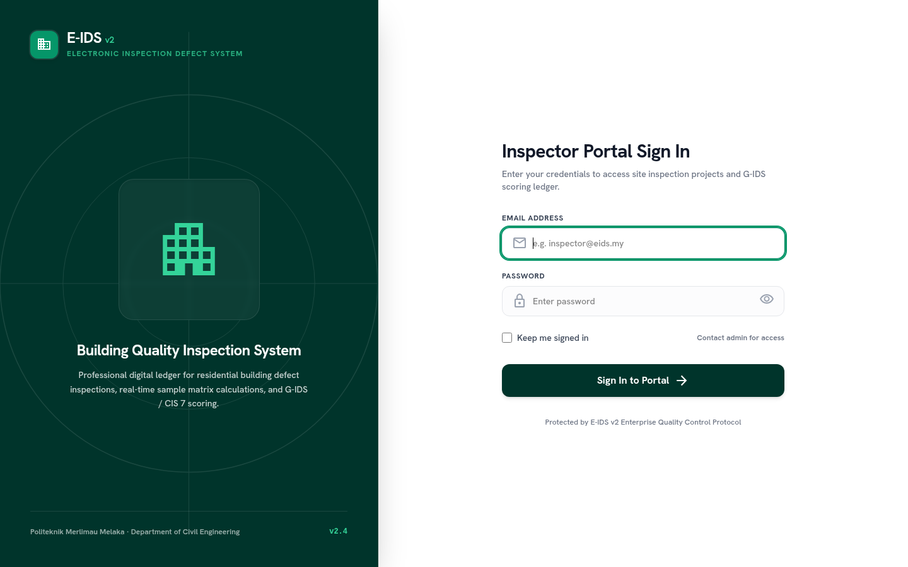
*The sign-in screen every role shares — the same login form routes Admin, Inspector, and Contractor to their own scoped view of the system.*

---

## 1. System Overview

E-IDS v2 is a specialized web-based building defect inspection and scoring platform for the Malaysian construction sector. Built in compliance with G-IDS / CIS 7 quality standards, E-IDS replaces manual paper-based forms with an end-to-end digital workflow:

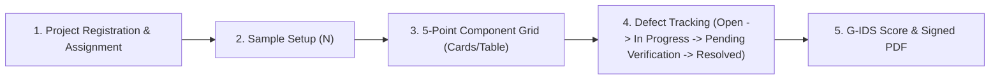

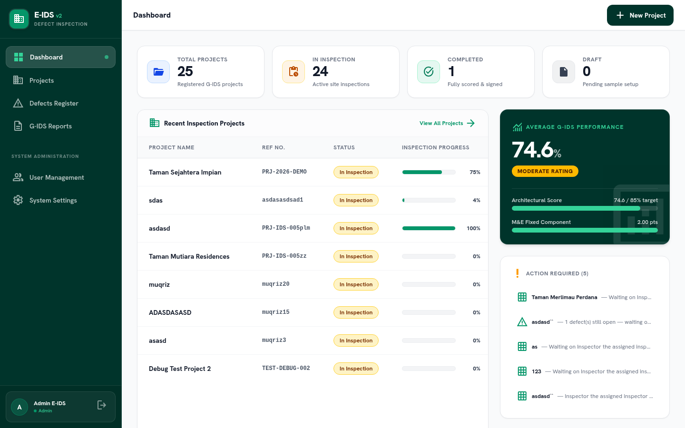
*The Dashboard is the landing page for Admin and Inspector — project totals, the average score across every visible project, and an Action Required list of what still needs attention.*

---

## 2. User Roles & Permission Matrix

E-IDS v2 supports **three** roles. Each role's view of the system is scoped — Admin sees every project; Inspector and Contractor see only what they're individually assigned to.

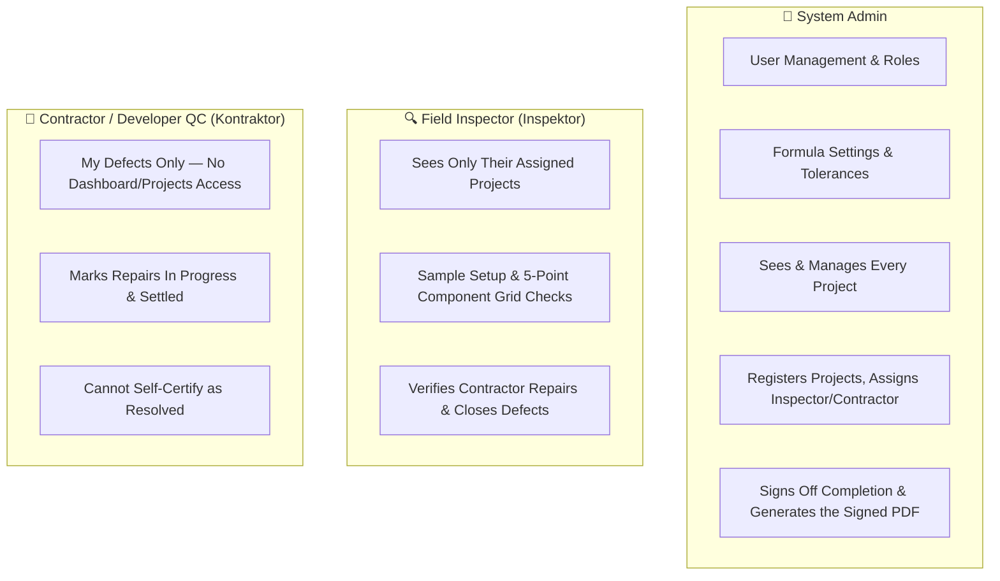

### Detailed Permissions Table

| Action / Capability | Admin | Inspector | Contractor |
| :--- | :---: | :---: | :---: |
| **View Dashboard, Projects & Reports** | ✅ all | ✅ assigned | ❌ |
| **Download Official PDF Report** | ✅ all | ❌ (view score only) | ❌ |
| **Register & Edit Projects** | ✅ | ✅ | ❌ |
| **Assign the Inspector (`assigned_to`)** | ✅ | ❌ (locked to self) | ❌ |
| **Assign the Contractor (`assigned_contractor_id`)** | ✅ | ✅ | ❌ |
| **Configure Sample Location Names** | ✅ | ✅ | ❌ |
| **Perform 5-Point Checks (`PASS`/`FAIL`)** | ❌ (handed off to Inspector) | ✅ | ❌ |
| **Upload Photo Evidence (Spatie Media)** | ❌ | ✅ | ❌ |
| **View Defects Register / My Defects** | ✅ all | ✅ assigned projects | ✅ own-assigned project only |
| **Create / Manually Log a Defect** | ✅ | ✅ | ❌ |
| **Mark Defect `IN_PROGRESS`** ("Start Repair") | ✅ | ✅ | ✅ |
| **Mark `IN_PROGRESS → PENDING_VERIFICATION`** ("Mark Settled") | ✅ | ✅ | ✅ |
| **Confirm `RESOLVED` or Reject back to `IN_PROGRESS`** | ✅ | ✅ | ❌ |
| **Mark Project as Completed (sign-off)** | ✅ | ❌ | ❌ |
| **Manage Users & Role Access** | ✅ | ❌ | ❌ |
| **Modify G-IDS Formula Settings** | ✅ | ❌ | ❌ |
| **Delete Project (with Modal Confirm)** | ✅ | ❌ | ❌ |

**What "scoped" means in practice:** opening a project or defect you don't have visibility into — whether from a list or by typing the URL directly — returns a "Forbidden" page for every role except Admin. This applies uniformly across Projects, the Dashboard, Defects, and Reports.

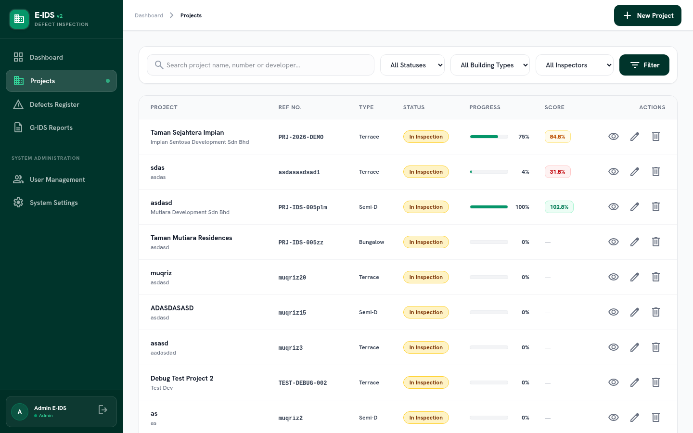
*The Projects list — the same page renders different rows for each role: Admin sees every project, Inspector and Contractor only ever see rows they're assigned to.*

---

## 3. Operational Role Handoff & Project Lifecycle

E-IDS v2 enforces a clear phase handoff between project creation, site inspection, contractor repairs, and final certificate sign-off. Admin's part of the workflow pauses once sample setup is saved — from there, the assigned Inspector and Contractor take over independently, each seeing only what's relevant to them — before Admin returns at the end to sign off and generate the certificate:

```mermaid
sequenceDiagram
    autonumber
    actor Admin as Admin
    actor Insp as Assigned Inspector
    actor Cont as Assigned Contractor

    Admin->>Admin: 1. Create Project, set GFA (m²), assign Inspector & Contractor
    Note over Admin: System auto-generates N sample slots
    Admin->>Admin: 2. Configure sample room location names & Save — pauses here for Admin
    Admin-->>Insp: Project now appears under "My Assigned Projects"
    Insp->>Insp: 3. Inspector opens project & runs Components Grid inspection (Cards View Mode)
    Note over Insp: FAIL checks auto-spawn OPEN Defects with Spatie Media photos
    Admin-->>Cont: 4. Defect now appears under Contractor's "My Defects"
    Cont->>Cont: 5. Contractor marks "Start Repair" (IN_PROGRESS), then "Mark Settled" (PENDING_VERIFICATION) once fixed
    Insp->>Insp: 6. Inspector re-inspects & either Confirms Resolved or Rejects back to IN_PROGRESS
    Insp->>Admin: 7. System recalculates Final G-IDS Score & Rating (GOOD/MODERATE/WEAK); Inspector is notified once inspection is 100% done and all defects are resolved
    Admin->>Admin: 8. Admin clicks "Mark as Completed" (only enabled once inspection is done and every defect is resolved), then exports the Signed G-IDS PDF Certificate
```

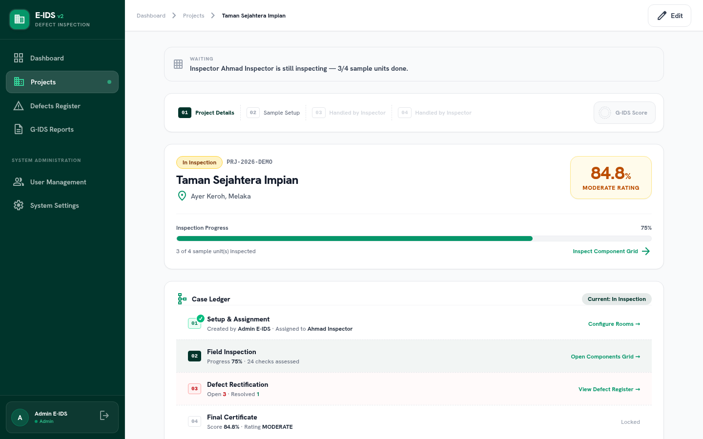
*The project page's Case Ledger is the single place this whole handoff is tracked — each row shows who's responsible, the key metric, and one action. Here, Field Inspection is active (green) and Defect Rectification needs attention (red) — Final Certificate stays locked until both clear.*

---

## 4. Defect Lifecycle & Status Workflow

When a defect is discovered during site inspection, it now follows a **4-stage** lifecycle, splitting the old single "In Progress" phase into a self-reported repair step and a formal verification step:

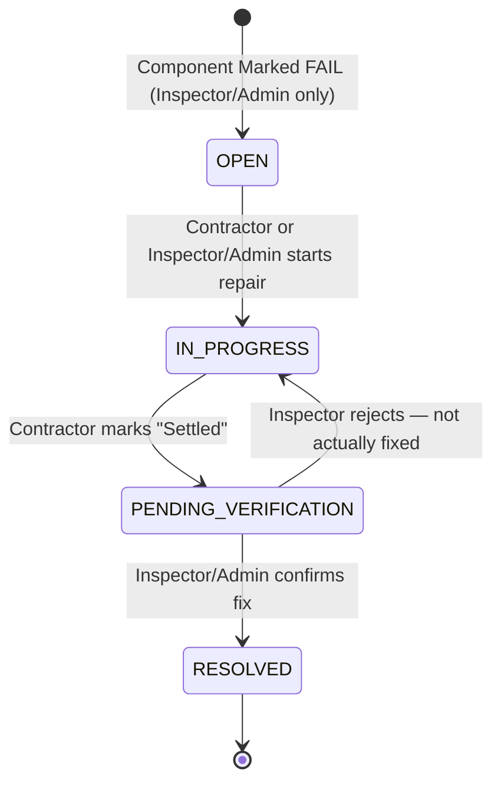

### Defect Status Breakdown

> [!IMPORTANT]
> **Who updates defect status?**
> The Contractor has their own login and updates status themselves for the repair steps (`IN_PROGRESS`, `PENDING_VERIFICATION`). The final `RESOLVED` confirmation — and the ability to reject a repair back to `IN_PROGRESS` — remains exclusively with the **Inspector** or **Admin**. A Contractor can never self-certify their own work as fully resolved.

1. **🔴 OPEN (Newly Discovered Defect)**
   - **Trigger**: Automatically created when an Inspector (or Admin) marks any of the 5 component criteria (Finishing, Hollow, Levelling, Joint, Crack) as `FAIL` during inspection, or manually logged.
   - **Action**: Defect appears in the assigned Contractor's **My Defects** list and the office's **Defects Register**, with severity tag (`Low`, `Medium`, `High`), room location, component code, and photo evidence via Spatie Media Library.

2. **🟡 IN_PROGRESS (Repair Underway)**
   - **Trigger**: The Contractor logs in and clicks **Start Repair** on the defect once they begin work on site (e.g., plaster touch-up, tile replacement, re-levelling). An Inspector or Admin can also set this manually if needed.
   - **Action**: Status updates in real time so the office knows a repair is genuinely underway, not just reported informally.

3. **🔵 PENDING_VERIFICATION (Awaiting Inspector Sign-off)**
   - **Trigger**: The Contractor clicks **Mark Settled** once they believe the repair is complete.
   - **Action**: The defect moves into a queue awaiting the Inspector's physical re-check. The Contractor sees a read-only "Awaiting Verification" badge and cannot advance it further themselves.

4. **🟢 RESOLVED (Verified & Closed)**
   - **Trigger**: The Inspector (or Admin) conducts a re-inspection of the specified location on site.
   - **Action**: Upon verifying the defect has been properly rectified to G-IDS standards, they click **Confirm Resolved**. If the repair is inadequate, they instead click **Reject – Not Fixed**, sending it back to `IN_PROGRESS` for the Contractor to redo.

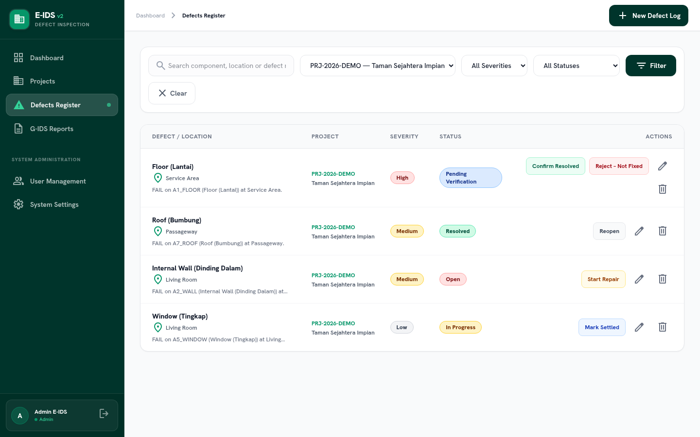
*All four states side by side: Open shows Start Repair, In Progress shows Mark Settled, Pending Verification shows Confirm Resolved / Reject – Not Fixed, and Resolved shows Reopen.*

---

## 5. UI/UX Feature Highlights

### 🧭 Role-Aware Guidance
Every project page shows a one-line **"what's next"** banner tailored to the viewer's role — e.g. an Admin sees *"Waiting on Inspector Aiman to begin the Components Grid inspection"*, while an Inspector sees *"2 defect(s) awaiting your verification."* The Dashboard additionally surfaces an **Action Required** widget for Admin/Inspector, listing their own visible projects that still need attention.

### 🎴 Dual View Mode (Components Grid)
To eliminate horizontal side-scrolling on mobile and tablet screens during site walkthroughs, E-IDS v2 provides two view modes on the **Components Grid**:

1. **Cards View (Default — Mobile & Touch Optimized)**:
   - Sample units are stacked as vertical cards.
   - 8 architectural components are rendered in a 2 to 4-column touch grid with high-contrast `PASS`, `FAIL`, or `PENDING` badges.
   - **Zero side-scrolling required**.

   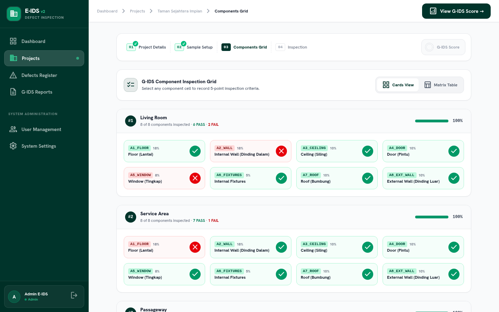

2. **Matrix Table View (Spreadsheet Mode)**:
   - Traditional table grid for desktop monitors and office review.

   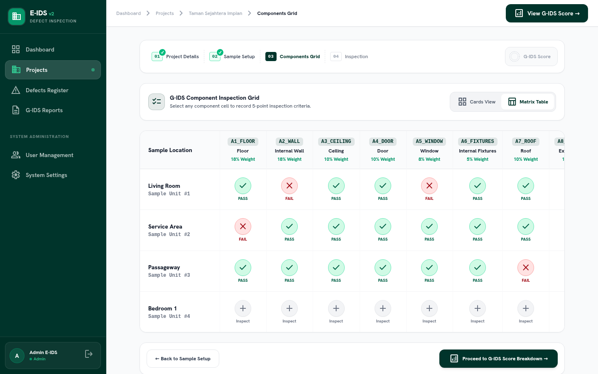

### 📷 Spatie Media Library Photo Storage
- Automated thumbnail generation ($300 \times 300\text{px}$) for fast table rendering.
- HD preview conversion ($800 \times 600\text{px}$) for PDF reports.
- Media items attached to inspection assessments are automatically copied to auto-spawned defect records.

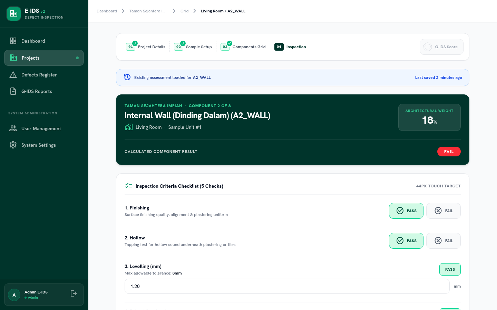
*The 5-point assessment form for one component — Finishing, Hollow, Levelling, Joint/Gap, and Crack, with the calculated PASS/FAIL result and photo evidence upload.*

### 🛡️ Modal Confirmation Dialogs
- All destructive actions (Deleting Projects, Deleting Defects, Deleting User Accounts) are protected by an Alpine.js modal dialog (`x-modal-confirm`) requiring explicit confirmation.

---

## 6. G-IDS Scoring Framework

The total G-IDS score ($S_{\text{total}}$) is calculated using native CIS 7 rules:

$$S_{\text{total}} = S_{\text{arch}} + S_{\text{M\&E}} + S_{\text{external}}$$

- **Architectural Subtotal ($S_{\text{arch}}$)**: Sum of 8 weighted component pass rates ($S_{\text{comp}}$):
  $$S_{\text{comp}} = \left( \frac{\text{Pass Count}}{\text{Total Assessed}} \right) \times \text{Weightage \%}$$
- **M&E Fixed Score ($S_{\text{M\&E}}$)**: 2.00 pts
- **External Work Fixed Score ($S_{\text{external}}$)**: 11.80 pts

### Rating Thresholds

> [!NOTE]
> - 🟢 **GOOD RATING**: Total score $\ge 85.00$ pts
> - 🟡 **MODERATE RATING**: Total score $\ge 70.00$ pts and $< 85.00$ pts
> - 🔴 **WEAK RATING**: Total score $< 70.00$ pts

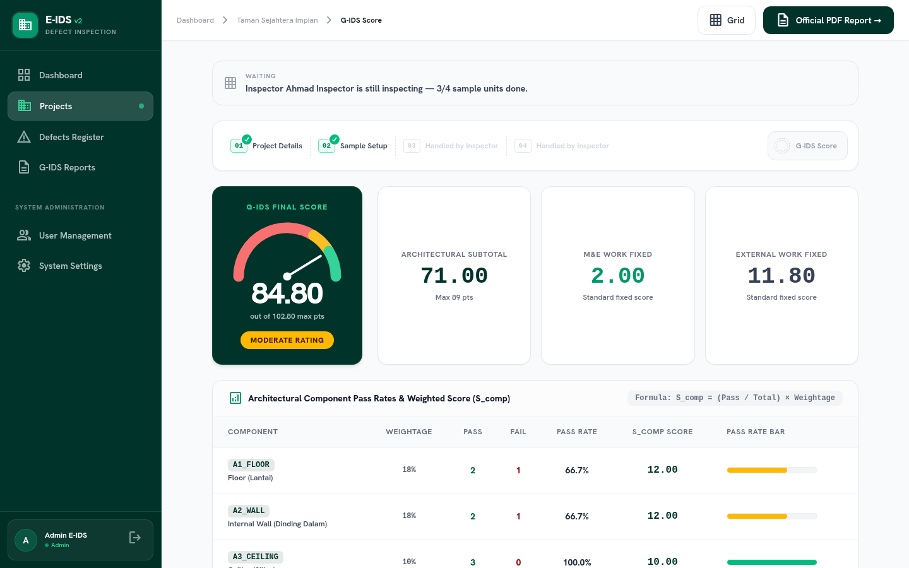
*The G-IDS Score page: the gauge's needle position and red/amber/green zones map directly to the rating thresholds above, with the full component-by-component breakdown below.*

---

## 7. Step-by-Step Operating Instructions

### Step 1: Project Registration & Team Assignment (Admin)
1. Navigate to **Projects** $\rightarrow$ Click **+ New Project**.
2. Enter Project Ref No., Project Name, Developer, Contractor, Building Type, and Total Units.
3. Enter Gross Floor Area (GFA $\text{m}^2$). The system auto-calculates sample units ($N = \lceil \text{GFA} \div 60 \rceil$).
4. Select the **Assigned Inspector** and **Assigned Contractor** from the dropdowns. (An Inspector creating a project instead is auto-assigned to themselves, and can still choose the Contractor — only Admin can assign the Inspector field.)
5. Click **Create Project**.

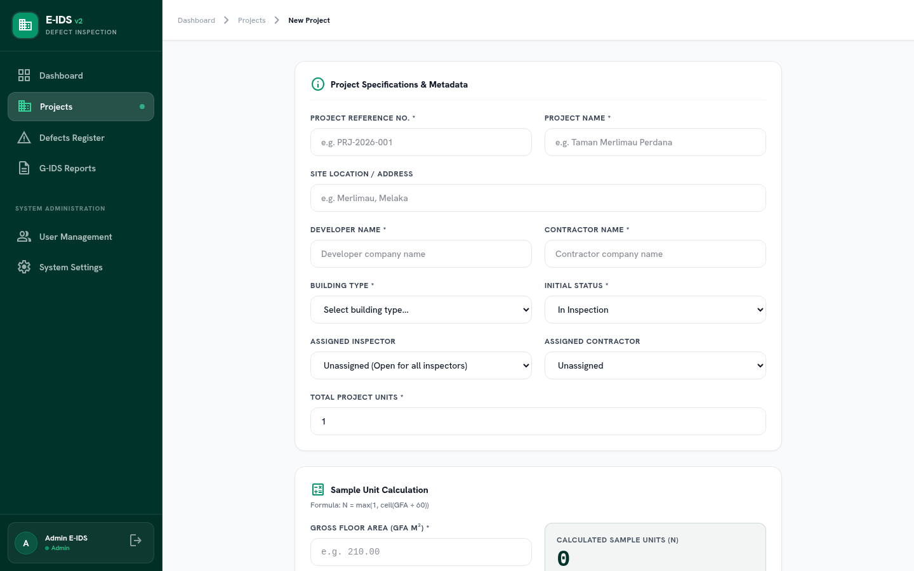

### Step 2: Sample Location Setup (Admin / Inspector)
1. System automatically redirects to **Sample Setup**.
2. Select default location names (e.g. *Master Bedroom*, *Living Room*, *Kitchen*) or enter custom room names.
3. Click **Save Locations**. For Admin, this pauses their part of setup — you're returned to the Project Overview page. The project now appears under the assigned Inspector's **My Assigned Projects**, ready for on-site inspection. (An Inspector doing their own setup instead continues straight into the Components Grid.)

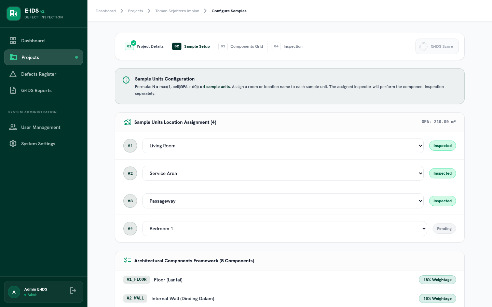

### Step 3: Component Inspection Matrix Grid (Inspector)
1. Open **Components Grid** (defaults to mobile-friendly **Cards View**) from **My Assigned Projects**.
2. Click any component tile (`D1`, `D2`, etc.) to open the **5-Point Assessment Form**:
   - **Finishing**: PASS / FAIL
   - **Hollow**: PASS / FAIL
   - **Levelling ($\text{mm}$)**: Enter measured $\text{mm}$ (auto-checked against $\le 3.0\text{mm}$ tolerance)
   - **Joint/Gap ($\text{mm}$)**: Enter measured $\text{mm}$ (auto-checked against $\le 1.0\text{mm}$ tolerance)
   - **Crack**: PASS / FAIL
3. Upload photo evidence if defects exist.
4. Click **Save & Next** to advance through component slots smoothly. A `FAIL` automatically opens a defect in the Contractor's queue.

### Step 4: Repair & Verification (Contractor, then Inspector)
1. **Contractor** logs in and lands directly on **My Defects** — a list scoped to their one assigned project.
2. Click **Start Repair** on an `OPEN` defect once work begins on site (moves it to `IN_PROGRESS`).
3. Click **Mark Settled** once the repair is complete (moves it to `PENDING_VERIFICATION`).
4. **Inspector** opens the **Defects Register**, filters to `Pending Verification`, and re-inspects the location on site.
5. Inspector clicks **Confirm Resolved** if the fix holds up, or **Reject – Not Fixed** to send it back to `IN_PROGRESS` for another attempt.

### Step 5: Score Review (Admin / Inspector)
1. Once every sample unit is inspected, the certification-seal button in the step bar unlocks — click it, or **G-IDS Score**, to review the final score, rating, and architectural component pass rates.
2. If any defect is still `OPEN`, `IN_PROGRESS`, or `PENDING_VERIFICATION`, the score page and PDF report stay locked with an explanatory message until every defect reaches `RESOLVED`.

### Step 6: Completion Sign-off & PDF Export (Admin only)
1. Once inspection is 100% done and every defect is `RESOLVED`, the project page's **Final Certificate** panel shows a **Mark as Completed** button.
2. Click it to formally close out the project (status becomes **Completed**) — this is a deliberate action; nothing marks a project Completed automatically.
3. Click **Generate Official PDF Report** to view or print the formal signed G-IDS Inspection Certificate.

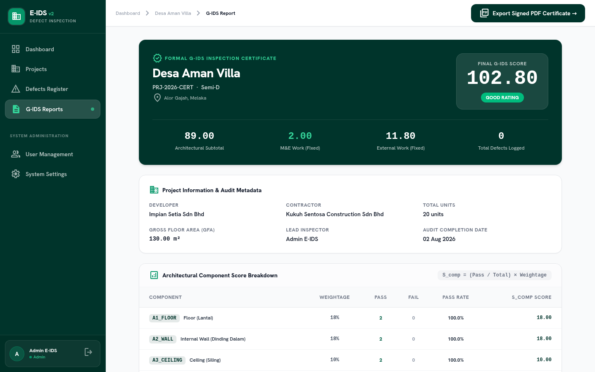
*The signed certificate — only reachable once inspection is 100% done and every defect is `RESOLVED`. Its "Export Signed PDF Certificate" button in the top bar produces the downloadable file.*

---

## 8. Demo / Testing Accounts

Running `docker exec -w /var/www eidsv2 php artisan migrate:fresh --seed` loads a ready-to-test dataset: **2 projects and 5 accounts covering all 3 roles**, split into an "A" set (Project 1) and a "B" set (Project 2) so you can log in as different users and see the role-scoping working directly — e.g. Inspector A only ever sees Project 1, Inspector B only ever sees Project 2.

| Role | Account | Password | Scope |
| :--- | :--- | :--- | :--- |
| Admin | `admin@eids.gov.my` | `password` | Sees everything; created both projects |
| Inspector | `inspector.a@eids.gov.my` | `password` | Assigned to Project 1 only |
| Inspector | `inspector.b@eids.gov.my` | `password` | Assigned to Project 2 only |
| Contractor | `contractor.a@eids.gov.my` | `password` | Assigned to Project 1 only — lands on **My Defects** |
| Contractor | `contractor.b@eids.gov.my` | `password` | Assigned to Project 2 only — lands on **My Defects** |

**Project 1 — "Taman Merlimau Perdana" (PRJ-2026-001):** 4 sample rooms, 3 fully inspected + 1 left pending (so you can see the "Continue — 3/4 done" banner). One defect seeded in **every lifecycle state** so every action button can be tested immediately:

| Defect | Location / Component | Status | What to test |
| :--- | :--- | :--- | :--- |
| 1 | Living Room / Internal Wall | `OPEN` | Contractor A sees **Start Repair** |
| 2 | Living Room / Window | `IN_PROGRESS` | Contractor A sees **Mark Settled** |
| 3 | Service Area / Floor | `PENDING_VERIFICATION` | Inspector A sees **Confirm Resolved** / **Reject**; Contractor A sees a read-only "Awaiting Verification" badge |
| 4 | Passageway / Roof | `RESOLVED` | Inspector A sees **Reopen** |

Score: 84.80 — **MODERATE** (just under the GOOD threshold, useful for demonstrating the rating boundary).

**Project 2 — "Desa Aman Villa" (PRJ-2026-002):** smaller, minimal setup — one `OPEN` defect only. Its main purpose is proving Contractor B / Inspector B never see Project 1's data. Score: 92.80 — **GOOD**.
