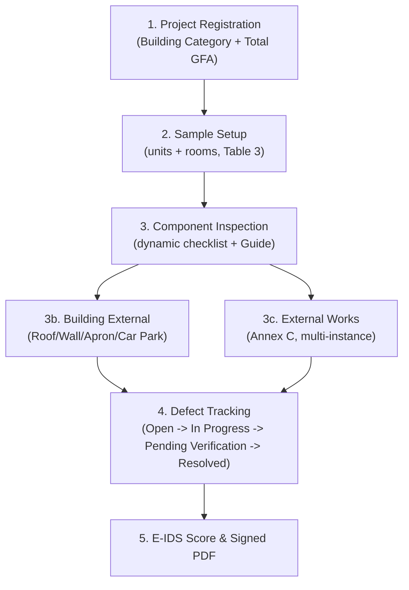
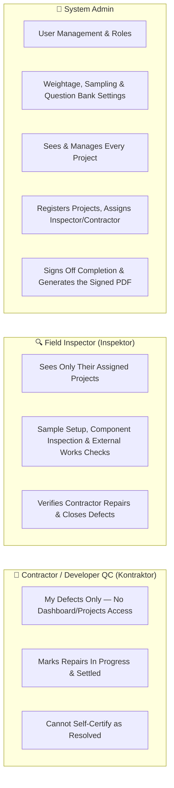
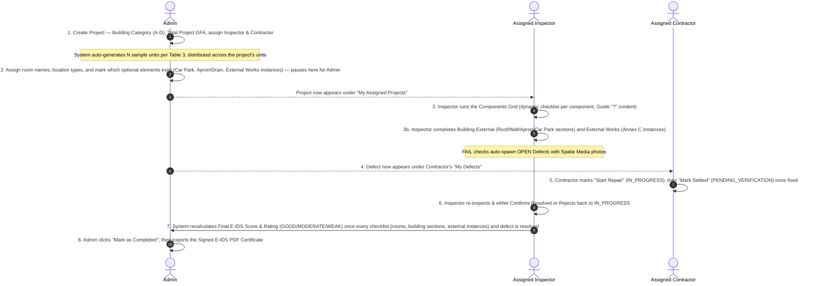
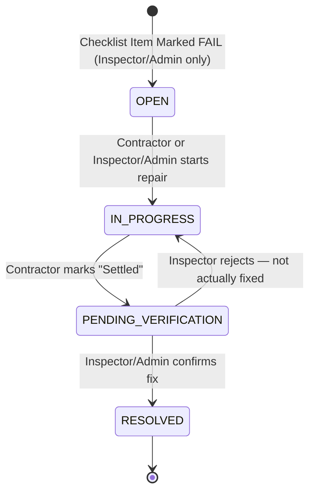

# E-IDS v2 — User Manual & Client Guide
**Electronic Inspection Defect System (E-IDS v2)**
*Official Operational Manual for Admins, Site Inspectors, and Contractors*

> Updated 2026-08-05 to reflect the CIS 7:2021-compliant scoring redesign: building categories, a real per-component question bank with Guide content, M&E (Annex B), External Works (Annex C) with multi-instance elements, and building-level architectural components (Roof/External Wall/Apron/Car Park).

*The sign-in screen every role shares — the same login form routes Admin, Inspector, and Contractor to their own scoped view of the system.*

---

## 1. System Overview

E-IDS v2 is a specialized web-based building defect inspection and scoring platform for the Malaysian construction sector, implementing **CIS 7:2021** (CIDB's Construction Industry Standard) natively rather than approximating it. E-IDS replaces manual paper-based forms with an end-to-end digital workflow:

*The Dashboard is the landing page for Admin and Inspector — project totals, the average score across every visible project, and an Action Required list of what still needs attention.*

---

## 2. User Roles & Permission Matrix

E-IDS v2 supports **three** roles. Each role's view of the system is scoped — Admin sees every project; Inspector and Contractor see only what they're individually assigned to.

### Detailed Permissions Table

| Action / Capability | Admin | Inspector | Contractor |
| :--- | :---: | :---: | :---: |
| **View Dashboard, Projects & Reports** | ✅ all | ✅ assigned | ❌ |
| **Download Official PDF Report** | ✅ all | ❌ (view score only) | ❌ |
| **Register & Edit Projects** | ✅ | ✅ | ❌ |
| **Assign the Inspector (`assigned_to`)** | ✅ | ❌ (locked to self) | ❌ |
| **Assign the Contractor (`assigned_contractor_id`)** | ✅ | ✅ | ❌ |
| **Configure Sample Locations & Optional Elements** | ✅ | ✅ | ❌ |
| **Perform Component Inspection Checklists** | ❌ (handed off to Inspector) | ✅ | ❌ |
| **Add/Remove External Works Instances** | ✅ | ✅ | ❌ |
| **Declare QP Certifications (Skim Coat, Water-tightness)** | ✅ | ✅ | ❌ |
| **Upload Photo Evidence (Spatie Media)** | ❌ | ✅ | ❌ |
| **View Defects Register / My Defects** | ✅ all | ✅ assigned projects | ✅ own-assigned project only |
| **Create / Manually Log a Defect** | ✅ | ✅ | ❌ |
| **Mark Defect `IN_PROGRESS`** ("Start Repair") | ✅ | ✅ | ✅ |
| **Mark `IN_PROGRESS → PENDING_VERIFICATION`** ("Mark Settled") | ✅ | ✅ | ✅ |
| **Confirm `RESOLVED` or Reject back to `IN_PROGRESS`** | ✅ | ✅ | ❌ |
| **Mark Project as Completed (sign-off)** | ✅ | ❌ | ❌ |
| **Manage Users & Role Access** | ✅ | ❌ | ❌ |
| **Edit Weightage/Sampling Tables & Question Bank** | ✅ | ❌ | ❌ |
| **Delete Project (with Modal Confirm)** | ✅ | ❌ | ❌ |

**What "scoped" means in practice:** opening a project or defect you don't have visibility into — whether from a list or by typing the URL directly — returns a "Forbidden" page for every role except Admin. This applies uniformly across Projects, the Dashboard, Defects, and Reports.

*The Projects list — the same page renders different rows for each role: Admin sees every project, Inspector and Contractor only ever see rows they're assigned to.*

---

## 3. Operational Role Handoff & Project Lifecycle

E-IDS v2 enforces a clear phase handoff between project creation, site inspection, contractor repairs, and final certificate sign-off:

*The project page — Case Ledger tracks the phase handoff, Project Specifications now show the CIS 7:2021 Building Category, and a QP Declarations card lets Admin/Inspector attach the Skim Coat and Wet-area Water-tightness certificates.*

---

## 4. Defect Lifecycle & Status Workflow

When a defect is discovered during site inspection, it follows a **4-stage** lifecycle:

### Defect Status Breakdown

> [!IMPORTANT]
> **Who updates defect status?**
> The Contractor has their own login and updates status themselves for the repair steps (`IN_PROGRESS`, `PENDING_VERIFICATION`). The final `RESOLVED` confirmation — and the ability to reject a repair back to `IN_PROGRESS` — remains exclusively with the **Inspector** or **Admin**. A Contractor can never self-certify their own work as fully resolved.

1. **🔴 OPEN (Newly Discovered Defect)**
   - **Trigger**: Automatically created when any checklist question — in a room, a building-level section, or an External Works instance — is marked `FAIL`, or manually logged.
   - **Action**: Defect appears in the assigned Contractor's **My Defects** list and the office's **Defects Register**, with severity tag (`Low`, `Medium`, `High`), location, component code, and photo evidence via Spatie Media Library.

2. **🟡 IN_PROGRESS (Repair Underway)**
   - **Trigger**: The Contractor logs in and clicks **Start Repair** on the defect once they begin work on site. An Inspector or Admin can also set this manually if needed.
   - **Action**: Status updates in real time so the office knows a repair is genuinely underway, not just reported informally.

3. **🔵 PENDING_VERIFICATION (Awaiting Inspector Sign-off)**
   - **Trigger**: The Contractor clicks **Mark Settled** once they believe the repair is complete.
   - **Action**: The defect moves into a queue awaiting the Inspector's physical re-check. The Contractor sees a read-only "Awaiting Verification" badge and cannot advance it further themselves.

4. **🟢 RESOLVED (Verified & Closed)**
   - **Trigger**: The Inspector (or Admin) conducts a re-inspection of the specified location on site.
   - **Action**: Upon verifying the defect has been properly rectified to CIS 7:2021 standards, they click **Confirm Resolved**. If the repair is inadequate, they instead click **Reject – Not Fixed**, sending it back to `IN_PROGRESS` for the Contractor to redo.

*The Defects Register — every state side by side, with the action button matching whoever's turn it is.*

---

## 5. Component Inspection — The Dynamic Checklist

This is the biggest change from earlier versions: there is **no fixed 5-point checklist** applied uniformly to every component. Each of the 8 architectural components (Floor, Internal Wall, Ceiling, Door, Window, Internal Fixtures, Roof, External Wall) has its **own** question bank straight out of CIS 7:2021's Annex A — Floor alone has 17 questions, other components have their own counts (see **§9. Managing the Question Bank**).

*The inspection screen for one sample: which physical unit it's in, the room name, and a full checklist table — Question / Method-Tool / Limit / Guide / Result. Numeric questions (like Floor Levelness) take a measurement and auto-derive PASS/FAIL against the tolerance; everything else is a PASS/FAIL toggle.*

### The Guide "?" Icon

Any question can have optional **Guide content** — tools needed, numbered inspection steps, the CIS 7:2021 limit, result thresholds, and even inline reference photos. It only appears when an admin has filled it in for that specific question.

*Tapping "?" opens this — formatted exactly as the admin authored it (bold text, lists, and images all render as shown).*

### Two Kinds of Architectural Components

Not every architectural component belongs to a room. CIS 7:2021's Table 3 splits sampling into two scopes:

- **Room-scoped** (Floor, Internal Wall, Ceiling, Door, Window, Internal Fixtures) — inspected at each of the project's sample room locations, shown in the main **Components Grid**.
- **Building-scoped** (Roof, External Wall, Apron & Perimeter Drain, Car Park) — sampled as building-level sections, not tied to any room. These live on their own **"Roof / Wall / Apron / Car Park"** page.

*Roof and External Wall sample counts scale with the project's unit count (50% of units, minimum 4 sections); Apron/Drain and Car Park use a fixed minimum of 2 sections. Every section is independently inspected and scored.*

---

## 6. M&E Fittings & External Works (Annex B & C)

### M&E Fittings (Annex B)

M&E Fittings get their own 6-question checklist, assessed at the **same room samples** as the architectural components (per Table 5) — you'll see an "M&E Fittings" tile alongside Floor/Wall/etc. in the Components Grid.

### External Works (Annex C)

External Works elements (Link-way/Shelter, External Drain, Roadwork, Footpath & Turfing, Fence & Gate, Playground, Court, Swimming Pool) live on their own page and now support **multiple instances of the same element** — e.g. a project with 3 separate playgrounds.

*Click "Add [Element]" to generate another full instance (its own Table 6 sample sections); click the red "×" on an instance to remove it — this permanently deletes that instance's inspection data and renumbers the remaining instances. Infrastructure elements (Link-way, Drain, Roadwork, Footpath, Fence/Gate) default to 1 instance present; Facilities/Amenities (Playground, Court, Pool) default to none until added.*

### QP Declarations

Two items — **Skim Coat/Prepacked Plaster** and **Wet-area Water-tightness Test** — aren't inspected on-site at all; they're Qualified Person certifications. Attach the evidence document on the Project page's **QP Declarations** card (see §3's screenshot) to earn their weightage.

---

## 7. E-IDS Scoring Framework (CIS 7:2021)

The total score is computed per CIS 7:2021's **Table 1**, which splits 100 points across three categories, weighted by the project's **Building Category** (A = Landed Housing, B = Stratified Housing, C/D = Commercial/Industrial):

$$S_{\text{total}} = S_{\text{arch}} + S_{\text{ME}} + S_{\text{external}}$$

| Category | Architectural | M&E | External |
| :--- | :---: | :---: | :---: |
| A — Landed Housing | 85% | 2% | 13% |
| B — Stratified Housing | 83% | 3% | 14% |
| C — Commercial/Industrial (no CCS) | 82% | 4% | 14% |
| D — Commercial/Industrial (with CCS) | 80% | 5% | 15% |

- **Architectural Subtotal**: each component's pass rate × its **Table 2** weightage (Floor 18%, Internal Wall 18%, Ceiling/Door/Window/Fixtures 8% each, Roof/External Wall 10% each, Apron/Drain and Car Park 3% each, Skim Coat and Water-tightness declarations 3% each). Internal-finish components are further weighted across sample locations by **Table 4** (Principal/Service/Circulation, also category-dependent). If an optional element (Car Park, Apron/Drain) doesn't exist on the project, its weightage is automatically redistributed across the rest — the project isn't penalized for lacking it.
- **M&E Subtotal**: a flat pass rate across every M&E Fittings answer, × the category's M&E %.
- **External Subtotal**: a flat pass rate pooled across every present External Works instance's answers, × the category's External %.

### Rating Thresholds (admin-configurable, defaults shown)

> [!NOTE]
> - 🟢 **GOOD RATING**: Total score $\ge 85.00$ pts
> - 🟡 **MODERATE RATING**: Total score $\ge 70.00$ pts and $< 85.00$ pts
> - 🔴 **WEAK RATING**: Total score $< 70.00$ pts

*The Score page now shows real M&E and External subtotals (pass rate + max points, not fixed numbers) alongside the Architectural breakdown. Scroll down for the Detailed Findings section listing every failed question by component and location.*

---

## 8. Step-by-Step Operating Instructions

### Step 1: Project Registration & Team Assignment (Admin)
1. Navigate to **Projects** → Click **+ New Project**.
2. Enter Project Ref No., Project Name, Developer, Contractor, Building Type, and **CIS 7:2021 Building Category**.
3. Enter **Total Project GFA (m²)** — the whole project's combined floor area (all units together), not a single unit's size. The system auto-calculates sample units via Table 3's clamped formula ($N = \text{clamp}(\lceil \text{GFA} \div \text{divisor} \rceil, \text{min}, \text{max})$, divisor/min/max depend on Building Category).
4. Select the **Assigned Inspector** and **Assigned Contractor** from the dropdowns.
5. Click **Create Project**.

### Step 2: Sample Setup (Admin / Inspector)
1. System redirects to **Sample Setup** — samples are pre-distributed across the project's units (Unit #1, #2, ...) and pre-named by cycling through the default room list, per CIS 7:2021 §1.7's "distributed as uniformly as possible" requirement.
2. Adjust room names, location type (Principal/Service/Circulation — drives Table 4 weighting), and mark whether **Car Park** and **Apron & Perimeter Drain** exist on this project.
3. Click **Save Locations** to hand off to the Inspector.

### Step 3: Component Inspection (Inspector)
1. Open **Components Grid** from **My Assigned Projects** — each room-scoped component (plus M&E Fittings) gets its own tile per sample.
2. Click a tile to open its full checklist (question count varies by component — Floor has 17, others differ).
3. Answer each question PASS/FAIL, or enter a measurement for numeric questions (auto-derived against the CIS 7:2021 limit). Tap "?" for Guide content where available.
4. Upload photo evidence if defects exist, then **Save & Next** to advance through the component's list, then the next component.
5. From the Grid's action bar, also complete **Roof / Wall / Apron / Car Park** (building-level sections) and **External Works** (Annex C instances) — both required before the project can be signed off.

### Step 4: Repair & Verification (Contractor, then Inspector)
1. **Contractor** logs in and lands directly on **My Defects** — scoped to their one assigned project.
2. Click **Start Repair** on an `OPEN` defect once work begins (moves it to `IN_PROGRESS`).
3. Click **Mark Settled** once the repair is complete (moves it to `PENDING_VERIFICATION`).
4. **Inspector** opens the **Defects Register**, filters to `Pending Verification`, and re-inspects the location on site.
5. Inspector clicks **Confirm Resolved** if the fix holds up, or **Reject – Not Fixed** to send it back to `IN_PROGRESS`.

### Step 5: Score Review (Admin / Inspector)
1. Once every checklist — rooms, M&E, building-level sections, and External Works instances — is inspected, the certification-seal button unlocks. Click it, or **E-IDS Score**, to review the final score, rating, and full breakdown.
2. If any defect is still `OPEN`, `IN_PROGRESS`, or `PENDING_VERIFICATION`, or if Building External / External Works sections remain un-inspected, the score page and PDF report stay locked with an explanatory message.

### Step 6: Completion Sign-off & PDF Export (Admin only)
1. Once inspection is 100% done — including Building External and External Works — and every defect is `RESOLVED`, the project page's **Final Certificate** panel shows a **Mark as Completed** button.
2. Click it to formally close out the project (status becomes **Completed**).
3. Click **Generate Official PDF Report** to view or print the formal signed E-IDS Inspection Certificate, which now includes QP Declaration status and a Detailed Findings section listing every failed question.

*The signed certificate — only reachable once every checklist is complete and every defect is `RESOLVED`.*

---

## 9. Admin — Managing the Question Bank & Guide Content

**Settings → Question Bank** lists every architectural component's checklist. Click a component tab to see its questions; click **Edit** on any question to change its text, defect group, method/tool, tolerance, or input type.

Each question also has an optional **Guide** section — a rich-text editor (bold, lists, links, and inline images, all rendered exactly as authored) for Tools Needed, Inspection Procedure, and Result Thresholds. Leave it blank to keep the "?" icon hidden for that question.

---

## 10. Admin — Weightage & Sampling Settings

**Settings** also exposes CIS 7:2021's reference tables directly, editable per Building Category:

- **Table 1** — overall Architectural/M&E/External % split by Building Category.
- **Table 4** — Principal/Service/Circulation location weighting by Building Category.
- **Table 3** — sample count formula (GFA divisor, min/max samples) by Building Category.
- **Table 2** — architectural component weightage (Floor, Wall, Ceiling, ... including the two QP declaration rows).

Changes apply immediately to scoring on every project — there's no need to re-create existing projects.

---

## 11. Demo / Testing Accounts

Running `docker exec -w /var/www eidsv2 php artisan migrate:fresh --seed` loads a ready-to-test dataset: **3 projects and 5 accounts covering all 3 roles**, sized to genuinely exercise Table 3's sample-count formula rather than a token handful of rooms.

| Role | Account | Password | Scope |
| :--- | :--- | :--- | :--- |
| Admin | `admin@eids.gov.my` | `password` | Sees everything; created all three projects |
| Inspector | `inspector.a@eids.gov.my` | `password` | Assigned to Project 1 and Project 3 |
| Inspector | `inspector.b@eids.gov.my` | `password` | Assigned to Project 2 only |
| Contractor | `contractor.a@eids.gov.my` | `password` | Assigned to Project 1 only — lands on **My Defects** |
| Contractor | `contractor.b@eids.gov.my` | `password` | Assigned to Project 2 and Project 3 — lands on **My Defects** |

**Project 1 — "Taman Merlimau Perdana" (PRJ-2026-001):** Category A, 50 units, Total GFA 10,500 m² → **150 samples** (Table 3's formula in action at real scale). The first 4 samples (all Unit #1: Living Room, Service Area, Passageway, Bedroom 1) carry a hand-built defect narrative — one in each of the four lifecycle states — with the remaining 146 samples fully passing. Also seeded: a Roof section FAIL, an External Drain instance FAIL, and **2 playgrounds** (one demonstrating the multi-instance External Works feature). Score: **95.68 — GOOD**.

| Defect | Location / Component | Status | What to test |
| :--- | :--- | :--- | :--- |
| 1 | Living Room / Internal Wall | `OPEN` | Contractor A sees **Start Repair** |
| 2 | Living Room / Window | `IN_PROGRESS` | Contractor A sees **Mark Settled** |
| 3 | Service Area / Floor | `PENDING_VERIFICATION` | Inspector A sees **Confirm Resolved** / **Reject**; Contractor A sees a read-only "Awaiting Verification" badge |
| 4 | Roof - Section 1 | `RESOLVED` | Inspector A sees **Reopen** |

**Project 2 — "Desa Aman Villa" (PRJ-2026-002):** Category A, 20 units, Total GFA 2,600 m² → 38 samples. **No Car Park** on this project — a live example of Table 2 weightage redistribution. Minimal inspection progress (one `OPEN` defect only) proves Contractor B / Inspector B never see Project 1's data. Score: **87.74 — GOOD**.

**Project 3 — "Kota Laksamana Heights" (PRJ-2026-003):** Category A, 12 units, Total GFA 2,160 m² → 31 samples. The only seeded project that's **fully signed off** (status `Completed`) — every checklist (rooms, M&E, building sections, External Works, including a Playground/Court/Pool) 100% inspected, both defects `RESOLVED`, both QP declarations attached. Use this one to see the unlocked certification-seal button, the fully-stamped Case Ledger, and the actual **Official PDF Certificate**. Score: **99.53 — GOOD**.
