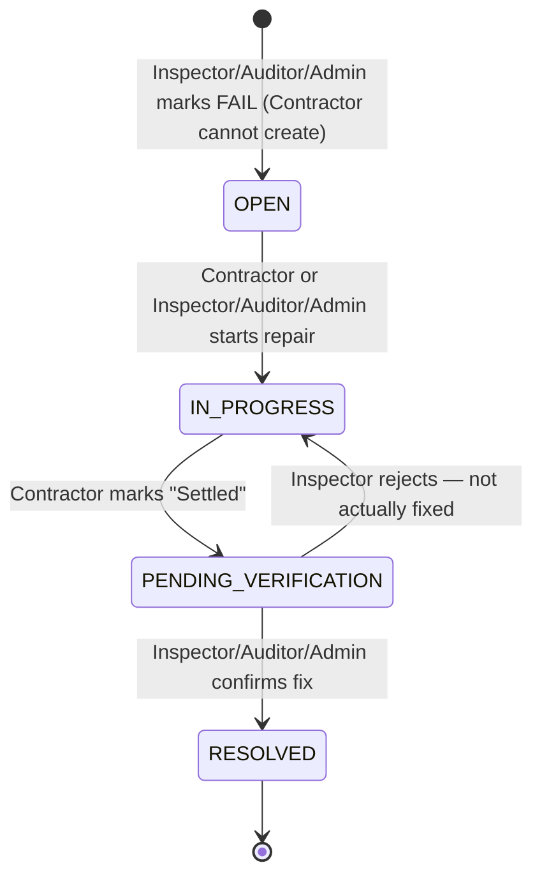

# Role-Scoped Visibility & Contractor Workflow — Design Spec

**Date:** 2026-08-02
**Project:** Electronic Inspection Defect System (E-IDS v2)
**Stack:** Laravel, MySQL, Blade + Alpine.js (no Livewire)

---

## 0. Context & Prior Work

Today, `Project`/`Dashboard`/`Defect` listings show **every** record to **every** authenticated
role — there is no scoping by `created_by`/`assigned_to`, and single-resource routes
(`/projects/{project}`, `/defects/{defect}/edit`, etc.) have no visibility check at all, so a
user can open any project/defect by URL even though the list UI doesn't surface it to them.

This spec closes that gap and adds a new `contractor` role so the physical repair step
(currently untracked — the Contractor works off-system and the Inspector self-reports on
their behalf) becomes a real, system-tracked step.

A related prior change (already shipped, not part of this spec): when an Admin/Lead Auditor
finishes Sample Setup, they're now returned to the Project Overview page instead of being
auto-advanced into the Components Grid, since Grid/Inspection is the Inspector's job, not
theirs.

---

## 1. Roles & Permissions

**New role: `contractor`**, added to the existing `admin` / `lead_auditor` / `inspector` /
`supervisor` set (`users.role` enum).

| Action | Admin | Lead Auditor | Inspector | Supervisor | Contractor |
|---|:---:|:---:|:---:|:---:|:---:|
| View Dashboard, Projects, Reports | ✅ (all) | ✅ (own-created) | ✅ (assigned) | ✅ (linked) | ❌ |
| View Defects | ✅ (all) | ✅ (own-created projects) | ✅ (assigned projects) | ✅ (linked projects) | ✅ (own-assigned project only) |
| Create/open a defect (FAIL check or manual log) | ✅ | ✅ | ✅ | ❌ | ❌ |
| Mark defect `IN_PROGRESS` | ✅ | ✅ | ✅ | ❌ | ✅ |
| Mark `IN_PROGRESS → PENDING_VERIFICATION` ("Settled") | ✅ | ✅ | ✅ | ❌ | ✅ |
| Confirm `RESOLVED` / reject back to `IN_PROGRESS` | ✅ | ✅ | ✅ | ❌ | ❌ |
| Assign Inspector / Contractor / Supervisors on a project | ✅ | ✅ | ❌ | ❌ | ❌ |

**Visibility rule** (who sees which projects — "individual unless you have management
permission over the whole pipeline"):

- **Admin** — all projects, no restriction.
- **Lead Auditor** — only projects they personally created (`created_by`).
- **Inspector** — only projects assigned to them (`assigned_to`).
- **Supervisor** — only projects they're linked to (new many-to-many, a project can have
  multiple client/regulator viewers).
- **Contractor** — only the one project they're assigned to as the repair contractor
  (`assigned_contractor_id`); no Dashboard/Projects/Reports access at all — their entire
  surface is a scoped "My Defects" list.

This applies to **both** list pages (Projects index, Dashboard, Defects register) **and**
direct single-resource URLs (`/projects/{project}`, `/projects/{project}/edit`,
`/defects/{defect}/edit`, etc.) — today only the former is even partially true, and the
latter has zero enforcement. After this change, opening a project/defect you can't see
returns `403`, for every role, not just the new Contractor one.

---

## 2. Defect Lifecycle

New 4-state lifecycle (was 3-state: `OPEN → IN_PROGRESS → RESOLVED`):



Contractor can self-report progress through `OPEN → IN_PROGRESS → PENDING_VERIFICATION`,
but cannot self-certify: closing to `RESOLVED` (or rejecting back to `IN_PROGRESS`) is
Inspector/Auditor/Admin-only, preserving the re-verification safeguard described in the
original manual.

---

## 3. Database Schema

Four migrations, following patterns already used in this codebase:

**3.1 — Add `contractor` to the role enum**
```php
DB::statement("ALTER TABLE users MODIFY role ENUM('admin','lead_auditor','inspector','supervisor','contractor') DEFAULT 'inspector'");
```

**3.2 — `assigned_contractor_id` on `projects`** (mirrors the existing `assigned_to` column)
```php
Schema::table('projects', function (Blueprint $table) {
    $table->foreignId('assigned_contractor_id')->nullable()->after('assigned_to')
          ->constrained('users')->nullOnDelete();
});
```
Single contractor per project, set via the same dropdown pattern as "Assigned Inspector" at
project create/edit time.

**3.3 — `project_supervisor` pivot table** (many-to-many)
```php
Schema::create('project_supervisor', function (Blueprint $table) {
    $table->foreignId('project_id')->constrained()->cascadeOnDelete();
    $table->foreignId('user_id')->constrained()->cascadeOnDelete();
    $table->primary(['project_id', 'user_id']);
});
```

**3.4 — Add `PENDING_VERIFICATION` to the defect status enum**
```php
DB::statement("ALTER TABLE defects MODIFY status ENUM('OPEN','IN_PROGRESS','PENDING_VERIFICATION','RESOLVED') DEFAULT 'OPEN'");
```

---

## 4. Visibility & Access Enforcement

Centralized query scope, one rule set reused everywhere (list pages and single-resource
guards alike) rather than duplicating role branches per controller:

```php
// Project.php
public function scopeVisibleTo($query, User $user)
{
    return match ($user->role) {
        'admin'        => $query,
        'lead_auditor' => $query->where('created_by', $user->id),
        'inspector'    => $query->where('assigned_to', $user->id),
        'supervisor'   => $query->whereHas('supervisors', fn ($q) => $q->where('user_id', $user->id)),
        'contractor'   => $query->where('assigned_contractor_id', $user->id),
        default        => $query->whereRaw('1 = 0'),
    };
}

public function supervisors()
{
    return $this->belongsToMany(User::class, 'project_supervisor');
}
```

```php
// Defect.php
public function scopeVisibleTo($query, User $user)
{
    return $query->whereHas('project', fn ($q) => $q->visibleTo($user));
}
```

**Usage:**
- `ProjectController::index()` / `dashboard()` → `Project::visibleTo(auth()->user())->...`
- `DefectController::index()` → `Defect::visibleTo(auth()->user())->...`
- Single-resource guard, added to `ProjectController::show/edit/update/destroy/samples/storeSamples`,
  `InspectionController::components/inspect/storeAssessment/score/summary`,
  `ReportController::show/pdf`, `DefectController::edit/update/destroy/advanceStatus`:
  ```php
  abort_unless(Project::visibleTo(auth()->user())->whereKey($project->id)->exists(), 403);
  ```
  (`Defect::visibleTo()` equivalent for defect-scoped actions)

---

## 5. Contractor Workflow

- **No Dashboard/Projects/Reports access.** Contractor's home is the existing
  `defects.index` route/controller, reused as-is with `Defect::visibleTo()` scoping applied
  — heading relabeled "My Defects", no "New Defect" button for this role.
- **Post-login redirect** (`AuthController::login`) branches by role: Contractor →
  `defects.index`, everyone else → `dashboard` (unchanged).
- **Navigation** hides Dashboard/Projects/Reports links for Contractor, leaving only "My
  Defects".
- **Status transitions** replace the current blind cycle (`toggleStatus()` currently loops
  `OPEN→IN_PROGRESS→RESOLVED→OPEN` with no edge validation). New `advanceStatus(Request,
  Defect)` validates the requested target against a transition map **and** the caller's
  role, since `PENDING_VERIFICATION` branches two ways (confirm vs reject) and a single
  "advance" button no longer fits:

  ```php
  private const TRANSITIONS = [
      'OPEN'                 => ['IN_PROGRESS'],
      'IN_PROGRESS'          => ['PENDING_VERIFICATION'],
      'PENDING_VERIFICATION' => ['RESOLVED', 'IN_PROGRESS'], // confirm or reject
      'RESOLVED'             => ['OPEN'], // reopen
  ];

  private const CONTRACTOR_ALLOWED = ['OPEN->IN_PROGRESS', 'IN_PROGRESS->PENDING_VERIFICATION'];
  // admin/lead_auditor/inspector may perform any edge in TRANSITIONS
  ```

  Buttons shown per state/role:
  - `OPEN` → "Start Repair" (Contractor + Inspector/Auditor/Admin)
  - `IN_PROGRESS` → "Mark Settled" (Contractor + Inspector/Auditor/Admin)
  - `PENDING_VERIFICATION` → "Confirm Resolved" / "Reject – Not Fixed" (Inspector/Auditor/Admin
    only; Contractor sees a read-only "Awaiting Verification" badge)
  - `RESOLVED` → "Reopen" (Inspector/Auditor/Admin only, unchanged)

- **Route middleware:** `defects.advance` (renamed from `defects.toggle`) opens to
  `role:admin,lead_auditor,inspector,contractor` — the transition map, not the route gate, is
  what stops a Contractor from self-certifying `RESOLVED`. `create`/`store`/`edit`/`update`/`destroy`
  stay `admin,lead_auditor,inspector`-only, unchanged.

---

## 6. Guidance UI

**Role-aware stepper + banner** — extends `<x-workflow-step>` with a `:role` prop; the
underlying "what should this project do next" logic lives in one place,
`Project::nextActionFor(User $user): array{icon, text}`, so both the project page banner and
the dashboard widget (below) pull the same sentence instead of duplicating rules.

- **Admin/Lead Auditor** — steps 3-5 (Grid/Inspection/Score) render as "Handled by Inspector"
  (grey, non-interactive) rather than today's generic "disabled, no project yet" state.
  Banner walks through: *"Finish naming sample locations"* → *"Waiting on Inspector Aiman to
  begin the Components Grid inspection"* → *"3 defect(s) still open — waiting on Contractor
  & Inspector verification"* → *"Inspection complete — ready to generate the signed G-IDS
  PDF."*
- **Inspector** — full interactive 5-step bar; banner: *"Start the Components Grid
  inspection"* → *"Continue — 5/8 sample units done"* → *"2 defect(s) awaiting your
  verification"* → *"Inspection complete — notify your Lead Auditor."*
- **Supervisor** — no interactive stepper, just a read-only status line, e.g. *"In progress
  — 3/8 sample units inspected"* or *"Certificate ready for download."*
- **Contractor** — doesn't reach project pages at all; no stepper.

**Dashboard "Action Required" widget** — built on `Project::visibleTo()`, filtered to what
that role needs to act on:
- Admin/Lead Auditor: projects fully sampled but inspection not started, or with defects
  stuck in `PENDING_VERIFICATION` too long.
- Inspector: assigned projects that are un-started, partially inspected, or have defects
  awaiting their verification.
- Supervisor: no widget — standard scoped dashboard cards only (they have no actions to
  take).
- Contractor: N/A, no dashboard.

**Project Create/Edit form additions:**
- **Assigned Contractor** dropdown — same pattern as "Assigned Inspector", sourced from
  `User::where('role', 'contractor')`.
- **Supervisors** multi-select (checkboxes) for the `project_supervisor` pivot, sourced from
  `User::where('role', 'supervisor')`. Settable by Admin/Lead Auditor only. Lives on both
  Create and Edit forms — no separate management screen.

---

## 7. Testing Plan

Feature tests (PHPUnit), targeting the risk points rather than exhaustive coverage:

- `Project::scopeVisibleTo` — one test per role, asserting the index returns exactly the
  expected project set against seeded fixtures.
- Direct-URL lockdown — a user with no visibility into a project gets `403` on
  `show`/`edit`/`samples`/`inspect`/`score`/`reports`.
- Defect transition guard — Contractor attempting `PENDING_VERIFICATION → RESOLVED` is
  rejected; Contractor doing `OPEN → IN_PROGRESS → PENDING_VERIFICATION` succeeds; Inspector
  can both confirm and reject from `PENDING_VERIFICATION`.
- Project create/edit — `assigned_contractor_id` and `project_supervisor` pivot rows persist
  correctly, settable only by Admin/Lead Auditor.
- Dashboard/"Action Required" widget — counts match the scoped query per role.
